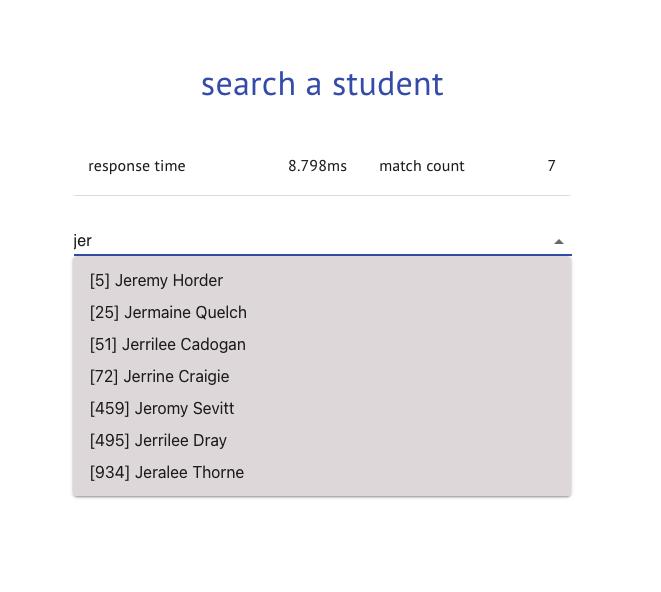

## full text search

A simple app that searches user provided keyword among informations of a thousand student.

### design & tech

**design**

- React app sends a request to the backend to search all students at initial page load.
- Backend parses the students from a JSON file, which mimics a 3rd party app call.
- After that, Redis caches the data makes consecutive calls faster.

**features**

- Full text search among all fields of students (id, first name, last name).
- A simple info table that shows response times and matching student count.

**tech**

- Frontend with ReactJS, Material UI
- Backend with NodeJS, Redis Cloud.

**notes on Redis Full Text Search (FTS)**

- Redis provides in-built FTS feature with RediSearch module. I tried to implement it for better comparison. Yet, its'
  NodeJS libraries are so erroneous, lack of documentation and ease of use.

### how to use

- Set environment variables `redis.host` and `redis.port` for your Redis (either local or cloud).
- Then run backend and frontend projects
